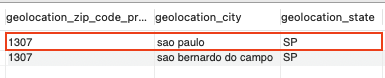
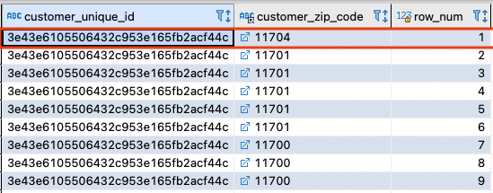
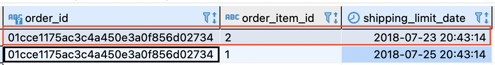
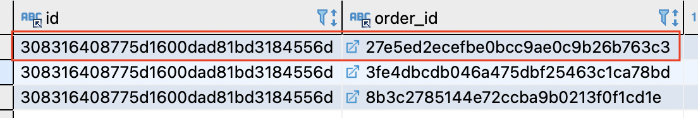
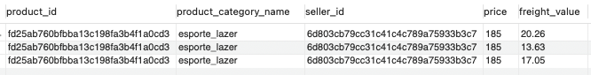
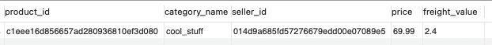
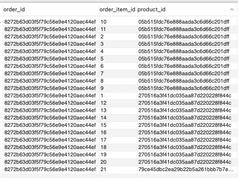
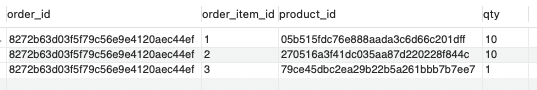

## ✏️ Exercise 4: Create the normalized data model from the original schema
In this exercise you are going to use the tables that you loaded in Exercise 1 to create the normalized model 
solution given by the teacher. 

1. Create the DDL's for the normalized tables
2. Create a new database called **olist_normalized**
3. Create the statements to load the data, follow the business logic below for de-duplication and data cleaning

The following have to be set before you load the data into the new tables:
 
````
SET SQL_SAFE_UPDATES=1;
SET FOREIGN_KEY_CHECKS=1; 
````

### Business rules: 

#### 1. Zip code duplicates
If there is more than one record with the same `zip_code`, the process of de-duplication will be to do it by
location city in descending order. 

Example: 
The selected record in red is the one that will have to be inserted. 



> HINT: Window functions 

#### 2. Non-existent zip code in location 

If a zip code existing in the `customers` or `sellers` table does not exist in the `location` table, you should default it to zip code 9999, with `DEFAULT`
as the value for the city and state. 

> HINT: 
> - You have to INSERT the default value to the `location` table in the normalized db and the `geolocation` table in the original db 
> - You have to UPDATE those missing values to the default value 

#### 3. Customers/Sellers with multiple zip codes
If a single customer/seller has multiple zip codes, for each customer/seller we will take the first zip code when ordering the customer_zip_code in descending order.   



> HINT: 
> - Use ROW_NUMBER() 

#### 5. An order is ship when all of it's items are ready to be send
An order must send all of its items at the same time, if an order has different shipping dates, take the first date 
as the truth for an order_id. 



#### 6. Dismiss all orders that do not have any order items attached 
Some orders like the following do not have any items associated with them, either because they were canceled, unavailable or some other reasons.

Order in `order` table: 

```
SELECT * FROM olist.`order` WHERE order_id = "fd4c3a2912e854eedd463b329540da4b";
```

No matches on the `order_items` table: 
```
SELECT * FROM order_items WHERE order_id = "fd4c3a2912e854eedd463b329540da4b";
```

If this is the case we won't load those orders  into our new normalized `orders` table. 

> NOTE: Consider this for all the other tables that use the `order_id` column
> i.e. The `review` table contains information about all orders disregarding the previous condition, to load the data into the
> normalized review table you will have to filter out all those orders that do not comply with the previous stated rule. 


#### 7. A review can only score one order_id
If one `review_id` has information for more than one `order_id` we are going to load only 
the review information for the first `order_id` when ordering in ascending order.



> HINT: ROW_NUMBER()


#### 8. Missing product category names
All products must have a `category_name` defined, if the value is missing you should update all records with:
* `nao_classificado` value for Portuguese   
* `unclassified` value for English translation

#### 9. Incorrect product categorization 
All products must be categorized correctly, meaning that there should be an entry with the classification name in Portuguese and their
proper translation into English in the `products_category_name_translation` table, if you find any record that is not categorized correctly, 
you need to update records with the following values: 
* `classificacao_errada` value for Portuguese
* `wrong_classification` value for English translation

#### 10. Multiple entries for same product within a seller 
A product may be sold by multiple sellers, but a product shouldn't be listed more than once in that sellers' catalog. If a product
appears to be more than once you should consolidate such records in a single one by taking the averages of price and freight_value respectively, 
each value should be rounded to 2 decimals.

Example: 

Original:



Result:



> HINT: Window functions 

#### 11. Invalid dates
If there's any invalid dates you can update them to `1970-01-02 00:00:00`


#### 12. Product aggregation
An order can have multiple products, either the same product or different ones, for the `order_items` table 
you have to aggregate by product_id the quantity of products on a particular order

Original:



Result: 




---

> NOTE: 
> 1. Place all your DDL's in `sol_exercise4.sql` file and place the file in the `Exercise4/Solutions` folder
> 

⚠️ The teacher should be able to run the file and load the data into the normalized model using your script without problems, so 
remember to include all statements. 