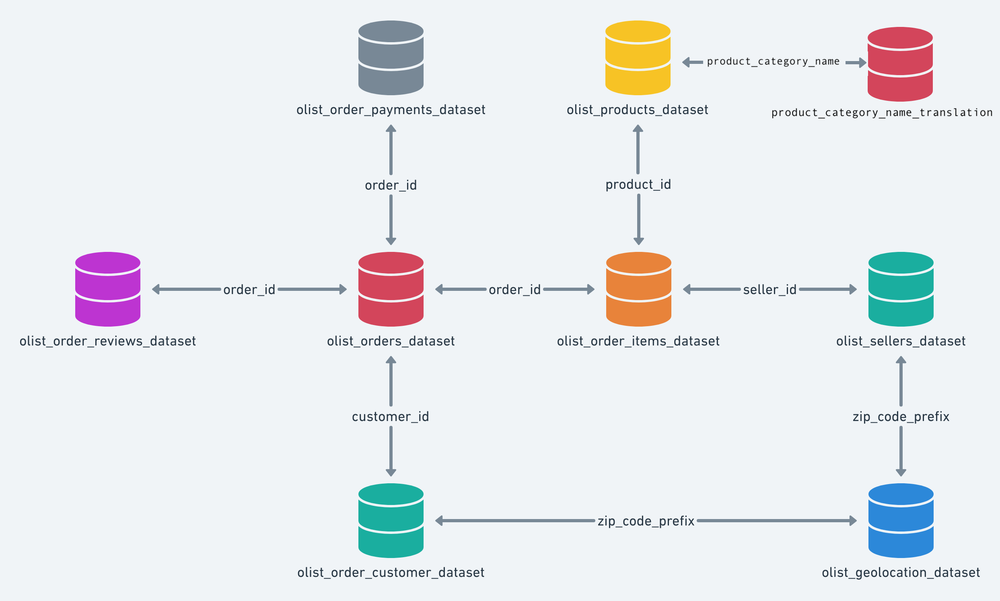

# DE101 - SQL Assignment

## About the dataset

We have a Brazilian e-commerce public dataset of orders placed at [Olist Store](https://olist.com/pt-br/), the largest department 
store in Brazilian marketplaces. Olist helps to connect small businesses from all over Brazil, these merchants are able to sell their products 
through the e-commerce site and ship their products directly to the costumers using Olist logistic partners. 

* An order might have multiple items.
* Each item might be fulfilled by a distinct seller.

> Note: This dataset contains real commercial data, all text identifying stores and partners where anonymized by replacing
> the data with the names of Game of Thrones houses.


## The data 
This dataset contains information of 100,000 orders from 2016 to 2018 made at multiple marketplaces in Brazil. With this data 
we can view an order from multiple dimensions: order status, price, payment,  customer location, product attributes and  reviews
written by customers. 

There are 9 flat csv files representing this dataset: 

### 1. Orders dataset
This is the core dataset. From each order you might find all other information.

**Columns**: 
* **order_id**: Unique identifier of the order.
* **customer_id**: Key to the customer dataset. Each order has a unique customer_id.
* **order_status**: Reference to the order status (delivered, shipped, etc).
* **order_purchase_timestamp**: Shows the purchase timestamp.
* **order_approved_at**: Shows the payment approval timestamp.
* **order_delivered_carrier_date**: Shows the order posting timestamp. When it was handled to the logistic partner.
* **order_delivered_customer_date**: Shows the actual order delivery date to the customer.
* **order_estimated_delivery_date**: Shows the estimated delivery date that was informed to customer at the purchase moment.

**File**: [olist_orders_dataset.csv](olist_dataset/olist_orders_dataset.csv)

---

### 2.  Customers dataset
This dataset has information about the customer and its location. Use it to identify unique customers in the orders 
dataset and to find the orders delivery location. At the olist system each order is assigned to a unique **customer_id**. 
This means that the same customer will get different ids for different orders. The purpose of having a **customer_unique_id** 
on the dataset is to allow you to identify customers that made repurchases at the store. Otherwise you would find that 
each order had a different customer associated with.

**Columns**: 
* **customer_id**: Key to the orders dataset. Each order has a unique customer_id.
* **customer_unique_id**: Unique identifier of a customer.
* **customer_zip_code_prefix**: First five digits of customer zip code.
* **customer_city**: Customer city name.
* **customer_state**: Customer state. 

**File**: [olist_customers_dataset.csv](olist_dataset/olist_customers_dataset.csv)

---

### 3. Sellers dataset
This dataset includes data about the sellers that fulfilled orders made at Olist. Use it to find the seller 
location and to identify which seller fulfilled each product.

**Columns**:
* **seller_id**: Seller unique identifier.
* **seller_zip_code_prefix**: First 5 digits of seller zip code.
* **seller_city**: Seller city name.
* **seller_state**: Seller state.

**File**: [olist_sellers_dataset.csv](olist_dataset/olist_sellers_dataset.csv)

---

### 4. Reviews dataset
This dataset includes data about the reviews made by the customers.
After a customer purchases the product from Olist Store a seller gets notified to fulfill that order. 
Once the customer receives the product or the estimated delivery date is due, the customer gets a satisfaction survey 
by email where he can give a note for the purchase experience and write down some comments.

**Columns**: 
* **review_id**: Unique review identifier.
* **order_id**: Unique order identifier.
* **review_score**: Note ranging from 1 to 5 given by the customer on a satisfaction survey.
* **review_comment_title**: Comment title from the review left by the customer, in Portuguese.
* **review_comment_message**: Comment message from the review left by the customer, in Portuguese.
* **review_creation_date**: Shows the date in which the satisfaction survey was sent to the customer.
* **review_answer_timestamp**: Shows satisfaction survey answer timestamp.

**File**: [olist_order_reviews_dataset.csv](olist_dataset/olist_order_reviews_dataset.csv)

---

### 5. Order items dataset
This dataset includes data about the items purchased within each order.

**Columns**: 
* **order_id**: Order unique identifier.
* **order_item_id**: Sequential number identifying number of items included in the same order.
* **product_id**: Product unique identifier.
* **seller_id**: Seller unique identifier.
* **shipping_limit_date**: Shows the seller shipping limit date for handling the order over to the logistic partner.
* **price**: Item price.
* **freight_value**: Item freight value item (if an order has more than one item the freight value is split between items)


**Example**
The order_id = `00143d0f86d6fbd9f9b38ab440ac16f5` has 3 items (same product). Each item has the freight calculated 
accordingly to its measures and weight. To get the total freight value for each order you just have to sum.

The total order item value is: `21.33 * 3 = 63.99`

The total freight value is: `15.10 * 3 = 45.30`

The total order value (product + freight) is: `45.30 + 63.99 = 109.29` 

**File**: [olist_order_items_dataset.csv](olist_dataset/olist_order_items_dataset.csv)

---

### 6. Products dataset
This dataset includes data about the products sold by Olist.

**Columns**: 
* **product_id**: Unique product identifier.
* **product_category_name**: Root category of product, in Portuguese.
* **product_name_lenght**: Number of characters extracted from the product name.
* **product_description_lenght**: Number of characters extracted from the product description.
* **product_photos_qty**: Number of product published photos.
* **product_weight_g**: Product weight measured in grams.
* **product_length_cm**: Product length measured in centimeters.
* **product_height_cm**: Product height measured in centimeters.
* **product_width_cm**: Product width measured in centimeters.

**File**: [olist_products_dataset.csv](olist_dataset/olist_products_dataset.csv)

---

### 7. Geolocation dataset
This dataset has information Brazilian zip codes and its lat/lng coordinates. You can use it to plot maps and find 
distances between sellers and customers.

**Columns**:
* **geolocation_zip_code_prefix**: First 5 digits of zip code.
* **geolocation_lat**: Latitude.
* **geolocation_lng**: Longitude.
* **geolocation_city**: City name.
* **geolocation_state**: State.

**File**: [olist_geolocation_dataset](olist_dataset/olist_geolocation_dataset)

---

### 8. Payments dataset
This dataset includes data about the orders payment options.

**Columns**:
* **order_id**: Unique identifier of an order. 
* **payment_sequential**: A customer may pay an order with more than one payment method. If he does so, a sequence will be created to accommodate all payments.
* **payment_type**: Method of payment chosen by the customer (credit_card, voucher, etc).
* **payment_installments**: Number of installments chosen by the customer.
* **payment_value**: Transaction value.

**File**: [olist_order_payments_dataset.csv](olist_dataset/olist_order_payments_dataset.csv)

---

### 9. Categories
In this data you can find the translated product category name to english.

**Columns**: 
* **product_category_name**: Category name in Portuguese. 
* **product_category_name_english**: Category name in English. 

**File**: [product_category_name_translation.csv](olist_dataset/product_category_name_translation.csv)


## Data Model
The data model for this dataset is described in the picture below: 



# Exercises: 
The following exercises have to be handed in, please create a folder called `Solutions` and put all the
solutions in here, each exercise will tell you how to name the files. 

## ✏️ Exercise 1: Design the database model 
Design the Olist e-commerce ER data model (diagram) as is, meaning that you don't have to make modifications, you will 
create the diagram according to the information about the datasets and their columns. You can use [dbdiagram.io](https://dbdiagram.io/) 
or [quickdatabasediagrams](https://app.quickdatabasediagrams.com/#/) tools to do so. 

Your diagram must include: 
* Tables, their columns and their data types
* PK and FK 
* Relationships (one-to-many, one-to-one, many-to-many)

> NOTE: Export your diagram as an image, name it `sol_exercise1.png` and place it in th `Solutions` folder, 
> if you made any assumptions please also include them as a readme file named `sol_exercise1.md`

## ✏️ Exercise 2: Create the DDL's and load the data
Setup a docker container with a MySQL instance, create all the DDL's and load the data into the tables. 
You will do this according to the **original** schema.

Your file should include: 
* All statements for table creation
* PK and FK definitions
* Indexes whenever they are needed
* Statement to load data into the tables
* **Dockerfile** or **docker-compose.yml** 

⚠️ The teacher should be able to run the file and load the data using your script without problems, so 
remember to include all statements. 


> NOTES: 
> 1. Place all your DDL's in `sol_exercise2.sql` file and place the file in the `Solutions` folder
> 2. Indexing may be needed in some tables for better performance


### Indexing Performance Example:
This query was executed in two databases, one where the tables had indexes and one without indexes: 
```shell script
SELECT * 
FROM customers 
JOIN orders ON orders.customer_id = customers.customer_id  
JOIN order_items ON order_items.order_id = orders.order_id 
LIMIT 0, 1000
```

| Without indexes | With indexes |
| :---            |    :----:    | 
| 30.126 sec      | 0.230 sec    | 


### Troubleshooting
Here are some issues that you may encounter and how to troubleshoot them. 

#### Error Code: 1290. MySQL server is running with the --secure-file-priv option
If you get the error when loading the data from the csv into your table, you need to mount a volume into your container 
pointing to the directory where your files are located to the **--secure-file-prive** path (`/var/lib/mysql-files/`).
```
Error Code: 1290. The MySQL server is running with the --secure-file-priv option so it cannot execute this statement
```

#### Error Code: 1292. Incorrect value: '' 
We are going to ignore this kind of error, you can do so in the SQL statements whenever you are loading the data. 

```
Error Code: 1292. Incorrect datatype value: '' for column 'column' at row 1131
```

#### Error Code: 1452. Cannot add or update a child row
This error can happen because data is not consistent across files, we most likely have a value in a column on the child table
that does not exist in the column of the parent table. 
```
Error Code: 1452. Cannot add or update a child row: a foreign key constraint fails (`database`.`table`, CONSTRAINT `constraint_ibfk_1` FOREIGN KEY (`column`) REFERENCES `table` (`column`))
```

To solve this error you can set `FOREIGN_KEY_CHECKS=0`, but remember to set it back to 1 after your are done loading the data. 
```shell script
SET FOREIGN_KEY_CHECKS=0;
```

## ✏️ Exercise 3: Normalize the data model 
If you take a look at the files we can see that we have scattered data across multiple files, there are repetitive 
columns that ideally should be combined. 

Let's create the normalized data model. You will do a functional dependency analysis for each of the tables and will 
determine if such tables are in breach of the 3rd normal form (remember that the normal forms cascade), if so you will have to normalize them. 

> NOTE: Export your diagram as an image, name it `sol_exercise3.png` and place it in the `Solutions` folder, additionally
> add a sol_exercise2.md file to explain the process of normalization for each table 

## ✏️ Exercise 4:  Create views and stored procedures 


#### Create a view for orders and the total price


> NOTE: Place all the DDL's `sol_exercise4.sql` file and place the file in the `Solutions` folder

## ✏️ Exercise 5: Business questions
Please answer the following questions regarding the Olist dataset.

> NOTE: Place all the DML's `sol_exercise5.sql` file and place the file in the `Solutions` folder, 
> include a comment for each query to know which exercise are you referring to. 

Example of sol_exercise5.sql file:
```
-- Question 1 
SELECT * FROM table; 

-- Question 2
SELECT * FROM table; 
```

#### Question 1:
Which are the top 10 cities with highest revenue from 2016 to 2018?  

In your result include the total number of orders placed 
and the total payment. 

#### Question 2:
How many products does each category has? 

Category names have to be in English. 

#### Question 3:
How many customers do we have in each city? 

Include the percentage of customers per city. 

#### Question 4:
What is the:

* maximum price of existing products?
* minimum price of existing products?
* average price of existing products?

Use a single query to get the 3 results.

#### Question 5:
What is the number and percentage of orders purchased in January 2017 with a 5 review score? 


#### Question 6: 
Identify all deliveries that were late by 10 or more days. 


#### Question 7: 
